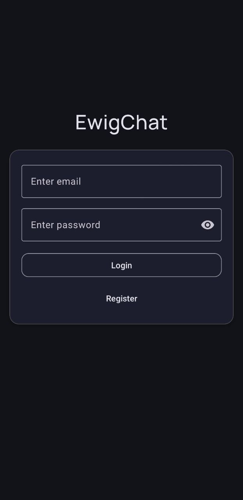
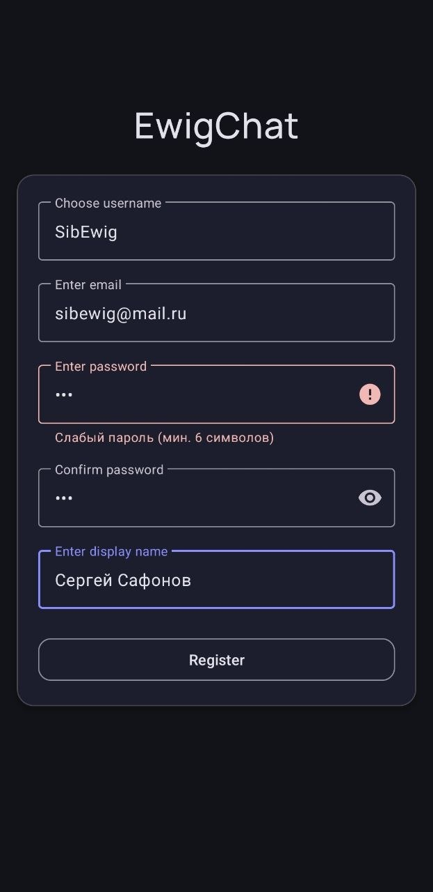
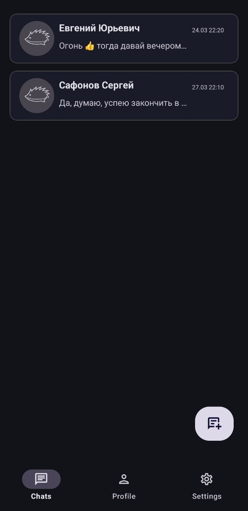
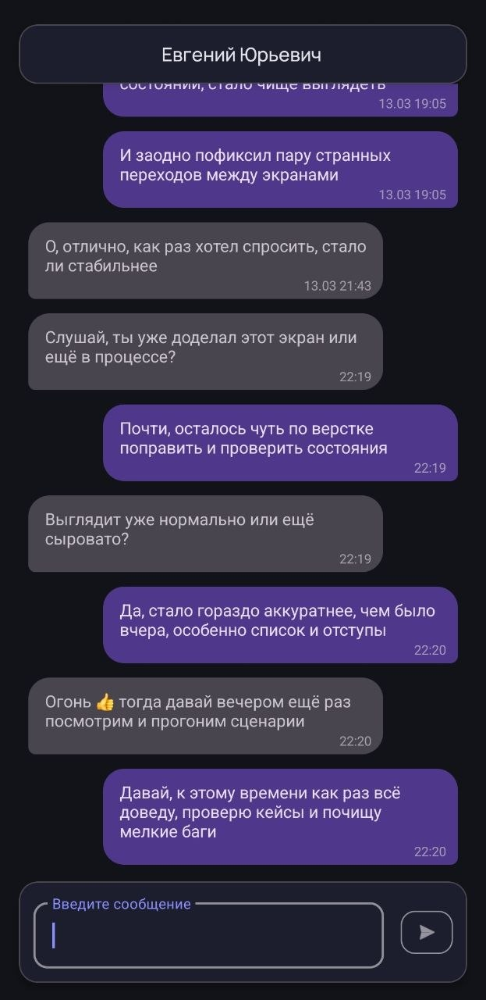
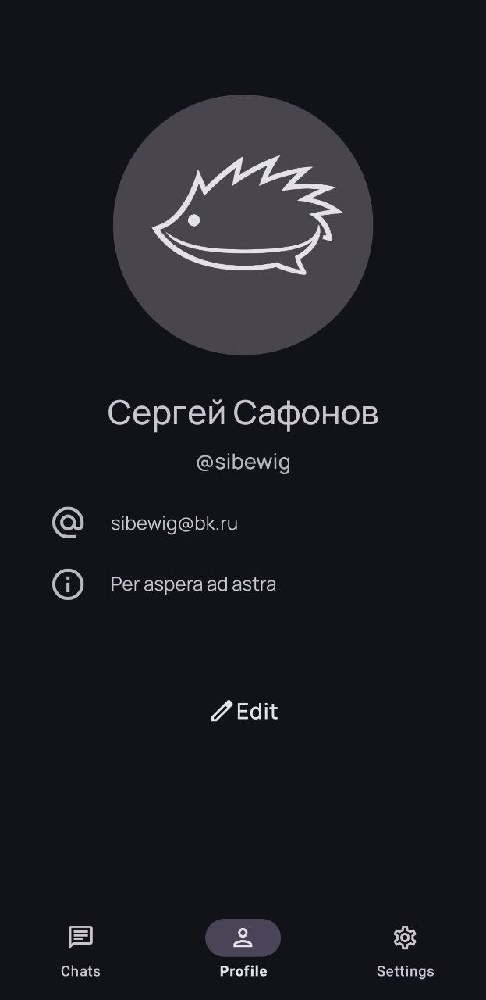

# EwigChat

Modern Android chat application built with Clean Architecture, MVVM and Firebase.

---

## 📱 Screenshots

  
  
  

  
  

---

## ✨ Features

- Firebase Authentication (email/password + email verification)
- Authentication via email or username
- Real-time chat using Cloud Firestore
- One-to-one messaging
- Username system with uniqueness check
- Profile management
- Reactive UI with Kotlin Flow
- Clean Architecture (data / domain / presentation)

---

## 🧱 Tech Stack

- Kotlin
- MVVM
- Clean Architecture
- Coroutines + Flow
- Hilt (Dependency Injection)
- Firebase Authentication
- Cloud Firestore
- Navigation Component
- Material 3
- ViewBinding

---

## 🏗 Architecture

The project follows Clean Architecture principles:

- **data layer** — repositories, Firebase integration, DTOs
- **domain layer** — use cases and business logic
- **presentation layer** — ViewModels and UI

Reactive data flow is implemented using Kotlin Flow and StateFlow.

---

## 🚀 Getting Started

1. Clone the repository
2. Create your Firebase project
3. Add `google-services.json` to the app module
4. Enable Authentication (Email/Password)
5. Set up Firestore database
6. Run the app

---

## 🔮 Future Improvements

- Push notifications (FCM)
- Online status and last seen
- Message and chat deletion
- Theme switching (dark / light / system)
- Localization (EN / RU)
- User avatar upload and management

---

## 📌 Status

MVP (Minimum Viable Product) — actively in development